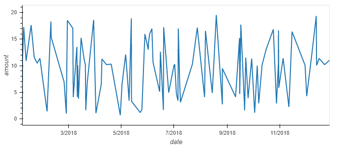
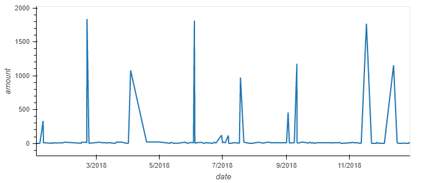
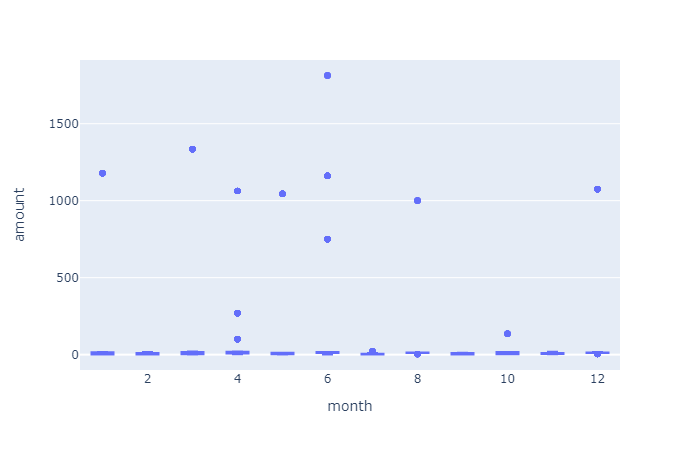
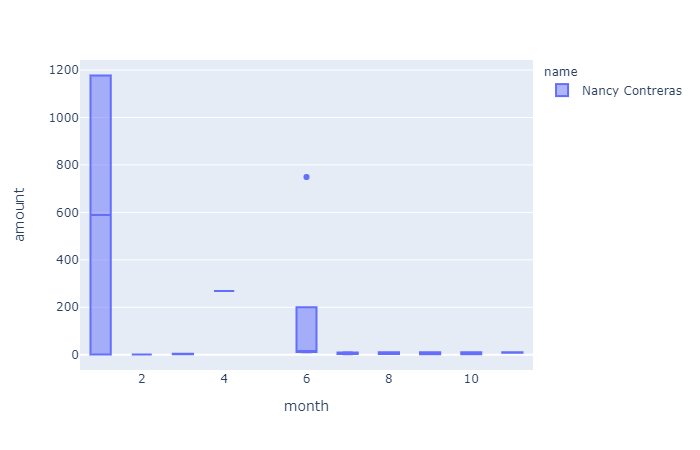

# Debit Card Fraud Anomalies Report

This report will identify anomalous transactions for clients given the parameters specialized and provide visualizations of the data for your review.

## Analyzing Consumption Patterns for clients
Below are line plots representing the time series of transactions over the course of a year.

### Cardholder ID 2

### Cardholder ID 18

### Comparison of Cardholder 2 and Cardholder 18
[Comparison]!(Images/bokeh_plot_3.png)

Card holder 2 consistently makes purchases under 20 dollars, most around 3-5 dollars. Cardholder 18 makes a larger variety of transactions, with different dollar amount. While Cardholder 18 does have some very high transaction spikes, it occurs almost monthly, the way you would expect from a monthly payment like rent and utilities you might pay at an apartment complex. The transactions for Card Holder 2 do not have the natural hills, valleys, or spikes you would see in regular transaction history and appears anomalous.

## Identifying Anomalous Spending by Employees

Below are box plots utilizing amounts and merchant types for employees intended to illustrate outlier transactions, and identify anomalous spending.

### Box Plot All Transactions

### Box Plot Merchant as Restaurants only

Examining the data, you do find outliers. I used 2 box plots to visualize the data. 

Outliers occurred primarily in January and June beyond the first quarter. 

If you use the query and filter for restaurants, then run the box plot a second time using "name" as color, you discover that Nancy Contreras is the only one using the card at restaraunts, and you can determine easily how much her MIN, MEDIAN, MAX expenditures are month to month.

