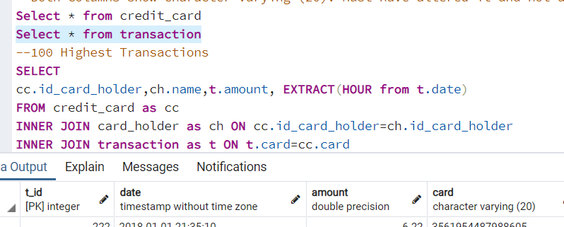
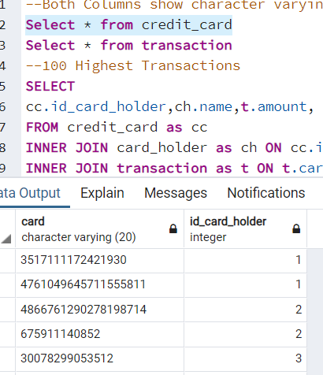

#Unit 7 SQL Homework Updates

I made updates based on the homework feedback in Bootcamp Spot.

### Postgre Sql
1. I attempted to update my transaction table from INT to VARCHAR. I realized that I had already done so before submitting the homework.

It turns out I never updated the schema, which I have now done.

2. I created a new queries .sql file with all queries used in the Jupyter Notebook and newly created viws.

### Jupyter Notebook
1. In the Jupyter Notebook, I updated all the queries to they are in order.
2. I updated the Top 5 Merchants question to reflect the merchant names. **Please Note** I still didn't get the exact answer provided. I did a count of all merchants and there was a 12 way tie for merchants with 5 transactions under 2 dollars. I tried a second query (query7a) where I attempted to SUM the amounts from the transaction table, and I still did not get the answer provided in the feedback. I may be interpreting the question incorrectly. If you have additional feedback it's appreciated.
3. I updated all queries to reflect less than 2 dollars per transaction (where applicable).
4. I added additional box plots to the question requesting 6 box plots. I misread that the first time I worked the assignment. I updated the report with images of those plots.